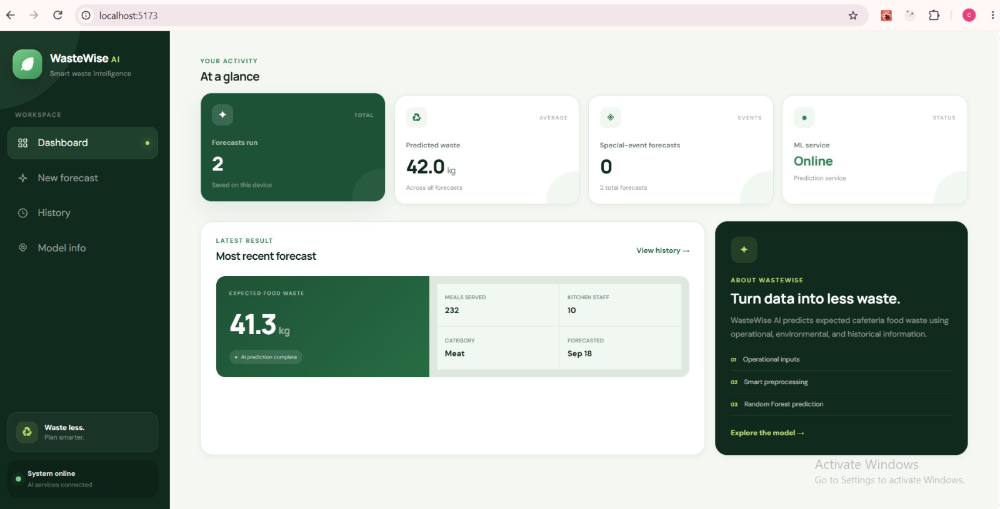
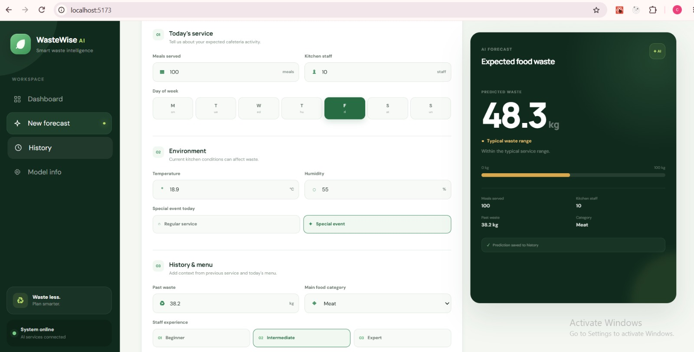
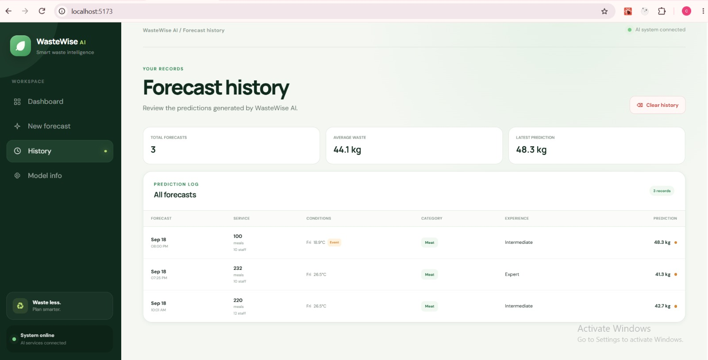
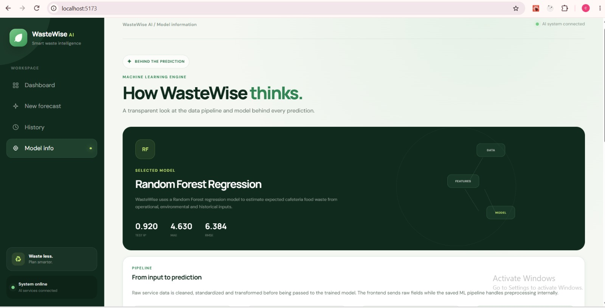

# 🌱 WasteWise AI

## Smart Cafeteria Food Waste Prediction System

WasteWise AI is a machine-learning-powered web application designed to predict expected cafeteria food waste using operational, environmental, and historical information.

The system helps cafeteria staff identify potentially high-waste situations before food is discarded, supporting more informed food preparation and resource-planning decisions.

---

## 🎯 Problem Statement

Food waste is a common problem in cafeterias, where food may be over-prepared because the amount that will actually be consumed is difficult to estimate in advance.

Over-preparation can lead to:

- Unnecessary food waste
- Financial loss
- Inefficient use of ingredients and resources
- Additional waste disposal
- Environmental impact

WasteWise AI addresses this problem by analyzing cafeteria conditions and predicting the expected amount of food waste in kilograms.

The prediction acts as a decision-support tool. Cafeteria staff can use the information to review preparation quantities, plan resources more carefully, and identify situations where unusually high food waste may occur.

> **Note:** WasteWise AI does not directly prevent food waste or determine the exact number of meals that should be prepared. It provides data-driven predictions that support better human decision-making.

---

# ✨ Main Features

## 📊 Dashboard

The dashboard provides an overview of forecasting activity, including:

- Total forecasts performed
- Average predicted food waste
- Number of special-event forecasts
- ML service connection status
- Most recent forecast
- Recent cafeteria service information

## ✨ New Forecast

Users can enter current cafeteria conditions and generate a food-waste prediction.

The prediction form collects:

- Meals served
- Kitchen staff
- Day of week
- Temperature
- Humidity
- Special-event status
- Previous food waste
- Main food category
- Staff experience

The information is sent through the backend to the ML prediction service, where the trained model predicts the expected food waste in kilograms.

## 🕒 Forecast History

The Forecast History interface allows users to review previous prediction results.

It displays information such as:

- Forecast date and time
- Meals served
- Kitchen staff
- Environmental conditions
- Food category
- Staff experience
- Predicted waste

The interface also provides summary information such as total forecasts, average predicted waste, and the latest prediction.

## 🧠 Model Information

The Model Info section provides information about the machine-learning component behind WasteWise AI, including:

- Selected machine-learning model
- Model performance
- Prediction pipeline
- Input features
- How cafeteria information is processed before prediction

---

# 🖥️ System Preview

## Dashboard

The WasteWise AI dashboard provides an overview of forecasting activity, recent predictions, and ML service availability.



---

## New Forecast

The New Forecast interface allows cafeteria staff to enter operational, environmental, and historical information and generate a food-waste prediction.



---

## Forecast History

Previous forecasts can be reviewed through the Forecast History interface.



---

## Model Information

The Model Information page provides information about the selected Random Forest regression model and its evaluation metrics.



---

# 🤖 Machine Learning

WasteWise AI treats food-waste estimation as a **supervised machine-learning regression problem**.

During model development, multiple regression algorithms were trained and evaluated.

| Model | MAE | RMSE | Test R² |
|---|---:|---:|---:|
| Random Forest Regressor | 4.630 | 6.384 | 0.920 |
| Gradient Boosting Regressor | 4.883 | 8.483 | 0.860 |
| Decision Tree Regressor | 6.885 | 14.491 | 0.590 |
| Linear Regression | 11.154 | 17.261 | 0.418 |

## 🌳 Selected Model

### Random Forest Regressor

The **Random Forest Regressor** achieved the strongest test performance among the evaluated models and was selected as the final prediction model.

### Final Model Performance

| Metric | Result |
|---|---:|
| R² | 0.920 |
| MAE | 4.630 kg |
| RMSE | 6.384 kg |

The R² score indicates that the model explains a large proportion of the variation in food-waste values within the test data.

---

# 📊 Dataset

The project uses the **Messy Food Waste Prediction Dataset**.

The training dataset contains:

- **911 records**
- **12 original columns**
- Prediction target: `food_waste_kg`

## Dataset Fields

| Field | Description |
|---|---|
| `ID` | Record identifier |
| `date` | Date of cafeteria record |
| `meals_served` | Number of meals served |
| `kitchen_staff` | Number of kitchen staff |
| `temperature_C` | Ambient temperature in Celsius |
| `humidity_percent` | Relative humidity percentage |
| `day_of_week` | Day of the week |
| `special_event` | Whether a special event occurred |
| `past_waste_kg` | Historical food-waste amount |
| `staff_experience` | Experience level of kitchen staff |
| `waste_category` | Main food/waste category |
| `food_waste_kg` | Actual food waste in kilograms — target variable |

## Current Model Inputs

The deployed model currently uses nine input features:

1. `meals_served`
2. `kitchen_staff`
3. `temperature_C`
4. `humidity_percent`
5. `day_of_week`
6. `special_event`
7. `past_waste_kg`
8. `staff_experience`
9. `waste_category`

The `ID` field is removed during preprocessing, while `food_waste_kg` is used as the prediction target.

---

# 🔍 Exploratory Data Analysis

Exploratory Data Analysis was performed before model development to understand the dataset and identify data-quality issues.

The analysis included:

- Dataset dimensions and structure
- Data types
- Missing-value analysis
- Duplicate detection
- Descriptive statistics
- Categorical-value inconsistencies
- Target distribution
- Numerical feature distributions
- Correlation analysis
- Outlier investigation
- Date-range analysis
- Special-event analysis
- Food-category analysis
- Staff-experience analysis

The EDA notebook is located at:

```text
ml-service/notebooks/01_eda.ipynb
```

---

# 🧹 Data Preprocessing

Raw cafeteria information is cleaned and transformed before being passed to the trained model.

The preprocessing process includes:

- Removing unnecessary identifier data
- Standardizing inconsistent categorical values
- Handling missing `staff_experience` values
- IQR-based outlier clipping
- One-hot encoding categorical variables
- Standardizing numerical variables
- Separating prediction features and the target variable
- Reusing fitted preprocessing artifacts during inference

The reusable preprocessing implementation is located at:

```text
ml-service/src/preprocessing.py
```

Saved preprocessing artifacts include:

```text
ml-service/models/scaler.pkl
ml-service/models/encoders.pkl
```

---

# 🏗️ System Architecture

WasteWise AI uses a separated frontend, backend, and machine-learning service architecture.

```text
┌────────────────────────┐
│          User          │
│    Cafeteria Staff     │
└───────────┬────────────┘
            │
            ▼
┌────────────────────────┐
│        Frontend        │
│     React + Vite       │
└───────────┬────────────┘
            │
            ▼
┌────────────────────────┐
│        Backend         │
│        FastAPI         │
└───────────┬────────────┘
            │
            │ HTTPX
            ▼
┌────────────────────────┐
│    ML Prediction API   │
│        FastAPI         │
│     POST /predict      │
└───────────┬────────────┘
            │
            ▼
┌────────────────────────┐
│     Data Cleaning      │
│    & Preprocessing     │
└───────────┬────────────┘
            │
            ▼
┌────────────────────────┐
│     Random Forest      │
│   Regression Model     │
└───────────┬────────────┘
            │
            ▼
   Predicted Food Waste
           (kg)
            │
            ▼
         Backend
            │
            ▼
         Frontend
            │
            ▼
           User
```

## Prediction Flow

```text
User enters cafeteria information
              ↓
React frontend sends the request
              ↓
FastAPI backend validates the data
              ↓
Backend forwards the request using HTTPX
              ↓
FastAPI ML service receives the input
              ↓
Raw data is cleaned
              ↓
Saved preprocessing transformations are applied
              ↓
Random Forest model generates a prediction
              ↓
Predicted food waste in kilograms is returned
              ↓
Backend returns the result
              ↓
Frontend displays the prediction
```

---

# ⚡ ML Prediction Service

The trained machine-learning model is exposed through a separate **FastAPI ML service**.

## Prediction Endpoint

```http
POST /predict
```

## Example Request

```json
{
  "meals_served": 300,
  "kitchen_staff": 10,
  "temperature_C": 28.0,
  "humidity_percent": 70.0,
  "day_of_week": 2,
  "special_event": 0,
  "past_waste_kg": 40.0,
  "staff_experience": "intermediate",
  "waste_category": "vegetables"
}
```

## Example Response

```json
{
  "predicted_food_waste_kg": 46.72
}
```

The `/predict` endpoint accepts cafeteria information, applies the saved preprocessing pipeline, and passes the transformed data to the trained Random Forest regression model.

---

# 🔌 Backend API

The backend acts as the intermediary between the React frontend and the ML prediction service.

## Backend Responsibilities

The backend is responsible for:

- Receiving prediction requests from the frontend
- Validating incoming cafeteria information using Pydantic
- Forwarding valid requests to the ML prediction service using HTTPX
- Returning ML predictions to the frontend
- Handling ML-service connection failures
- Handling ML-service timeouts
- Handling unexpected ML-service responses
- Providing backend and ML-service health information
- Supporting cross-origin frontend requests using CORS

## Backend Endpoints

### `GET /`

Returns the current backend API status.

Example:

```json
{
  "message": "WasteWise AI Backend API is running"
}
```

### `GET /health`

Reports the backend status and checks whether the ML prediction service is reachable.

Example:

```json
{
  "backend_status": "ok",
  "ml_api_status": "reachable",
  "ml_api_url": "http://localhost:8001"
}
```

### `POST /predict`

Receives cafeteria information from the frontend, validates the request, sends it to the ML service, and returns the resulting food-waste prediction.

## Backend Validation

The backend validates prediction inputs before forwarding them to the ML service.

| Input | Validation |
|---|---|
| Meals served | Greater than 0 and up to 2000 |
| Kitchen staff | Greater than 0 and up to 100 |
| Temperature | -10°C to 55°C |
| Humidity | 0% to 100% |
| Day of week | 0 to 6 |
| Special event | 0 or 1 |
| Previous waste | 0 to 500 kg |
| Staff experience | beginner, intermediate, or expert |
| Waste category | Non-empty string |

`day_of_week` follows:

```text
0 = Monday
1 = Tuesday
2 = Wednesday
3 = Thursday
4 = Friday
5 = Saturday
6 = Sunday
```

# 🛠️ Technologies Used

## Frontend

- React 18
- React DOM
- Vite 5
- JavaScript
- HTML
- CSS

## Backend

- Python
- FastAPI
- Pydantic
- HTTPX
- FastAPI CORS Middleware

## Machine Learning

- Python
- Pandas
- NumPy
- Scikit-learn
- Joblib
- Jupyter Notebook

## ML Prediction Service

- FastAPI
- Uvicorn
- Pydantic
- Joblib

## Development & Collaboration

- Git
- GitHub
- Visual Studio Code

---

# 📁 Project Structure

```text
wastewise-ai-food-waste-predictor/
│
├── backend/
│
├── dataset/
│   ├── train.csv
│   ├── test.csv
│   └── submission.csv
│
├── docs/
│   └── screenshots/
│       ├── dashboard.png
│       ├── new-forecast.png
│       ├── forecast-history.png
│       └── model-info.png
│
├── frontend/
│
├── ml-service/
│   ├── models/
│   │   ├── encoders.pkl
│   │   ├── final_pipeline.pkl
│   │   ├── model_comparison_results.csv
│   │   ├── scaler.pkl
│   │   └── waste_model.pkl
│   │
│   ├── notebooks/
│   │   ├── 01_eda.ipynb
│   │   ├── 02_preprocessing.ipynb
│   │   └── 03_model_training.ipynb
│   │
│   ├── src/
│   │   ├── preprocessing.py
│   │   └── pipeline.py
│   │
│   └── app.py
│
├── .gitignore
└── README.md
```

---

# 🚀 Running WasteWise AI

The application consists of three main services:

1. ML Prediction Service
2. Backend API
3. React Frontend

The ML prediction service should be available to the backend before predictions are requested.

---

## 1️⃣ Run the ML Prediction Service

Navigate to:

```bash
cd ml-service
```

Install the required dependencies:

```bash
pip install fastapi uvicorn pandas numpy scikit-learn joblib
```

Start the ML service on port `8001`:

```bash
uvicorn app:app --reload --port 8001
```

The ML API will be available at:

```text
http://localhost:8001
```

Swagger documentation:

```text
http://localhost:8001/docs
```

---

## 2️⃣ Run the Backend

Open another terminal and navigate to the backend directory:

```bash
cd backend
```

Install the required dependencies:

```bash
pip install fastapi uvicorn pydantic httpx
```

Start the backend on a different port, for example:

```bash
uvicorn app:app --reload --port 8000
```

The backend will then communicate with the ML service at:

```text
http://localhost:8001
```

The backend also supports the `ML_API_BASE_URL` environment variable if a different ML-service address is required.

---

## 3️⃣ Run the Frontend

Open another terminal and navigate to:

```bash
cd frontend
```

Install the frontend dependencies:

```bash
npm install
```

Start the Vite development server:

```bash
npm run dev
```

Vite will display the frontend development URL in the terminal, typically:

```text
http://localhost:5173
```

---

# 👥 Team Members & Responsibilities

All team members also contributed to the machine-learning development process.

# 🌍 Real-World Impact

WasteWise AI is designed to support more informed cafeteria food-preparation and resource-planning decisions.

Traditionally, cafeteria staff may only discover that too much food was prepared after the unused food has already become waste.

WasteWise AI provides an estimate of expected food waste using current cafeteria conditions.

If the system predicts unusually high waste, cafeteria staff can use that information to:

- Review planned preparation quantities
- Investigate previous waste patterns
- Prepare food in manageable batches where appropriate
- Improve ingredient and resource planning
- Pay closer attention to high-waste situations
- Make more data-informed operational decisions

Potential benefits include:

- Reduced unnecessary food waste
- Better use of ingredients
- Reduced avoidable financial loss
- More efficient resource utilization
- Reduced environmental impact associated with unnecessary food production and disposal

WasteWise AI is therefore designed as a **decision-support system**, not as an automated system that guarantees food-waste prevention.

---

# 🔮 Future Improvements

Possible future developments include:

- Recommended food preparation quantities
- Waste-risk levels such as Low, Moderate, and High
- Advanced waste trend analytics
- Improved prediction-history persistence
- Food-category-specific recommendations
- Model retraining using newly collected cafeteria records
- Larger and more diverse training datasets
- Automated model-performance monitoring
- Cloud deployment
- User authentication and role management
- Notifications for potentially high-waste situations
- Mobile-responsive enhancements

A future recommendation component could combine the existing waste-prediction model with additional decision rules or optimization techniques to suggest preparation adjustments while still accounting for expected cafeteria demand.

---

# 🎓 Academic Project

WasteWise AI was developed as an academic Machine Learning project demonstrating the complete machine-learning development lifecycle.

```text
Real-World Problem Identification
              ↓
        Dataset Selection
              ↓
 Exploratory Data Analysis
              ↓
       Data Preprocessing
              ↓
        Model Training
              ↓
       Model Evaluation
              ↓
        Model Selection
              ↓
      ML API Development
              ↓
 Backend & Frontend Development
              ↓
        System Integration
              ↓
 Working Full-Stack ML Application
```

---

# 📄 License

This project was developed for academic and educational purposes.